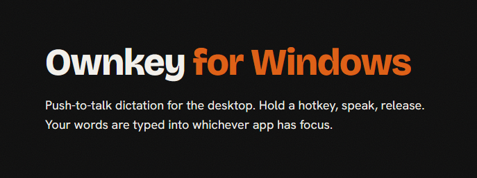
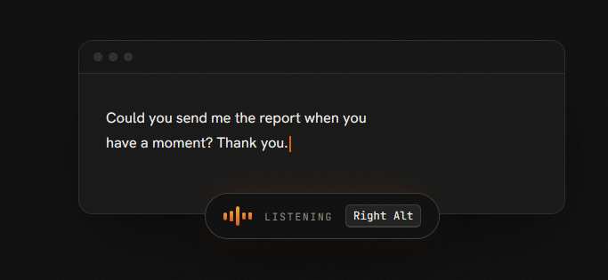
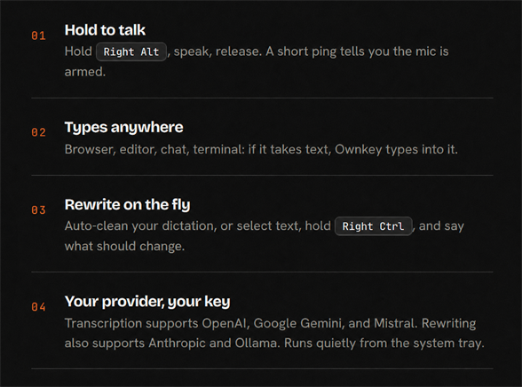

<div align="center">
  <a href="https://ownkey.bvdm.ai">
    
  </a>
</div>

<p align="center">
  <a href="https://ownkey.bvdm.ai"><strong>Website</strong></a>
  ·
  <a href="https://github.com/MajesteitBart/ownkey-keyboard"><strong>Ownkey for Android</strong></a>
  ·
  <a href="#03--get-started"><strong>Get started</strong></a>
</p>

<p align="center">
  
  
  <a href="LICENSE"></a>
  <a href="https://ownkey.bvdm.ai"></a>
</p>

<p align="center">
  
</p>

Ownkey for Windows is push-to-talk dictation and AI rewrite for the desktop.
Hold a hotkey, speak, release, and your words are typed into whichever app has
focus.

You bring the provider and API key. Ownkey has no account, subscription, relay
server, or telemetry: requests travel directly from your PC to the provider you
configure.

> **Your keys. Your voice. Your space.**

## 01 · The promise

### Private by default. Not by settings.

| Private by default | No data collection | Bring your own key | Open by design |
|---|---|---|---|
| Privacy is the starting point, not a setting to find. | No Ownkey telemetry, account, or hosted service. | Your provider, your account, your control. | MIT-licensed and developed in the open. |

Ownkey does send audio—and selected text when you use rewriting—to your chosen
AI provider. It does not put an Ownkey-operated server in the middle.

## 02 · What it does

<p align="center">
  
</p>

The ready chime is optional. Audio and rewriting can use independent providers,
keys, endpoints, and models, and Ownkey can start automatically with Windows.

## 03 · Get started

Ownkey is currently available from GitHub. Check
[Releases](https://github.com/MajesteitBart/ownkey-windows/releases) for a
prebuilt Windows installer. If no release asset is listed, run it from source or
build the installer locally.

### Run from source

Requires Windows 10 or 11 and Python 3.11+.

```powershell
git clone https://github.com/MajesteitBart/ownkey-windows.git
cd ownkey-windows
py -m pip install -r requirements.txt
py ownkey.py
```

Ownkey starts in the system tray. Right-click the tray icon, open **Settings**,
choose providers for **Audio** and **Rewriting**, enter your API keys, refresh
the model lists, and save.

### Build the Windows installer

The repository includes an Inno Setup installer build. Install Python 3.11+,
Node.js with pnpm, Rust with the MSVC toolchain, Visual Studio Build Tools, and
[Inno Setup 6](https://jrsoftware.org/isinfo.php), then run:

```bat
build-installer.bat
```

The versioned installer is written to `dist-installer\`. It packages the
PyInstaller backend, Tauri overlay, shortcuts, uninstaller, and Ownkey branding.

## 04 · Use it

| Action | Default |
|---|---|
| Dictate | Hold `Right Alt`, speak, then release |
| Rewrite selected text | Select text, hold `Right Ctrl`, speak an instruction, then release |
| Open Settings | Right-click the tray icon → **Settings** |
| Quit | Right-click the tray icon → **Quit** |

Examples of rewrite instructions include “make this more formal”, “translate to
English”, and “turn this into bullet points”.

### AI rewrite

- **Auto-rewrite dictation** removes filler words, applies self-corrections,
  fixes punctuation, and follows your tone, formatting, and custom instructions.
  If rewriting fails, Ownkey inserts the raw transcript.
- **Rewrite selected text** captures the selected text and your spoken
  instruction, sends both to the configured rewrite provider, and replaces the
  selection with the result.

## 05 · Bring your own key

1. **Get a key** from a supported provider, or configure a compatible endpoint.
2. **Paste it once** in Settings and choose the model you want to use.
3. **Speak**. Audio goes from your device to your provider; text comes back and
   is inserted into the focused app.

No Ownkey account. No Ownkey subscription. No Ownkey telemetry. Pay your
provider, not us.

### Provider support

Audio and rewriting can use different providers and credentials.

| Provider | Audio transcription | Rewriting | Model discovery |
|---|---:|---:|---|
| OpenAI | Yes | Yes | `/v1/models` |
| Anthropic | — | Yes | `/v1/models` |
| Google Gemini | Yes | Yes | `/v1beta/models` |
| Mistral | Yes | Yes | `/v1/models` |
| Ollama | — | Yes, local or cloud | `/api/tags` |

Endpoints and model names remain editable for compatible aliases or custom
deployments. Ollama presets include local `http://localhost:11434/api/chat` and
cloud `https://ollama.com/api/chat` endpoints; Ownkey does not bundle a model.

## Configuration

Settings are managed in the app and stored in
`%APPDATA%\Ownkey\config.json`. API keys are stored locally in that file, so
treat it as sensitive.

| Setting | Default | Purpose |
|---|---|---|
| Audio provider | Mistral | Transcription provider |
| Audio model | `voxtral-mini-latest` | Transcription model |
| Dictation hotkey | `Right Alt` | Hold-to-talk key |
| Language | Auto | Automatic detection or a fixed language |
| Paste mode | On | Clipboard paste instead of key-by-key typing |
| Ready chime | Off | Sound when the microphone is armed |
| Rewrite provider | Mistral | Text rewrite provider |
| Rewrite model | `mistral-small-latest` | Chat model used for rewrites |
| Rewrite hotkey | `Right Ctrl` | Hold-to-talk rewrite key; can be disabled |
| Auto-rewrite | Off | Clean every dictation before insertion |

Older configs using shared `api_key`, `endpoint`, `model`, and `chat_endpoint`
fields are migrated automatically.

## Development

Build the portable backend bundle:

```bat
build.bat
```

Output: `dist\Ownkey\Ownkey.exe`. This is a folder-based PyInstaller bundle;
keep the complete `dist\Ownkey` directory together.

Build the Tauri overlay:

```powershell
cd overlay-ui
pnpm install
pnpm build
```

Run the provider tests:

```powershell
py -m unittest discover -s tests
```

The overlay receives local state updates over UDP `127.0.0.1:38485`. See
[overlay-ui/README.md](overlay-ui/README.md) for its payload format and
development controls.

## Troubleshooting

- **Hotkey does nothing in an elevated app:** run Ownkey as Administrator.
  Windows blocks non-elevated apps from typing into elevated ones.
- **No audio:** allow microphone access in Windows Settings under
  **Privacy & security → Microphone**.
- **Paste mode fails in one app:** disable paste mode so Ownkey types the text
  key by key.
- **Provider or model errors:** verify the activity-specific key and endpoint,
  then use **Refresh** in Settings to confirm that the provider returns models.

## License

[MIT](LICENSE) · © 2026 Ownkey
