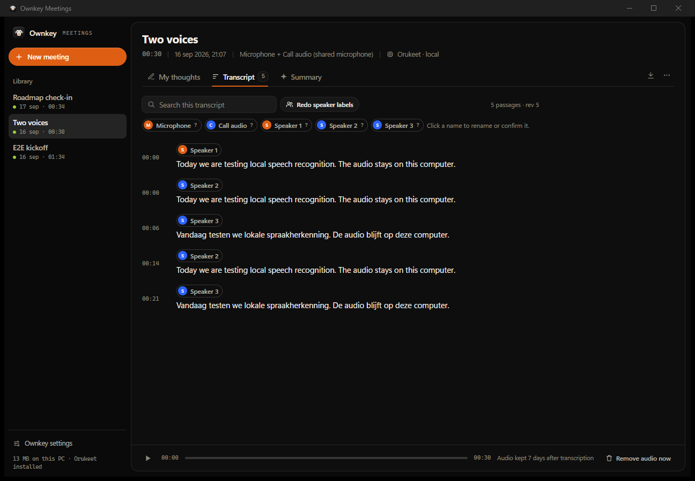

<div align="center">
  <a href="https://ownkey.bvdm.ai">
    
  </a>
</div>

<p align="center">
  <a href="https://ownkey.bvdm.ai"><strong>Website</strong></a>
  ·
  <a href="https://github.com/MajesteitBart/ownkey-keyboard"><strong>Ownkey for Android</strong></a>
  ·
  <a href="#03--get-started"><strong>Get started</strong></a>
</p>

<p align="center">
  
  
  <a href="LICENSE"></a>
  <a href="https://ownkey.bvdm.ai"></a>
</p>

<p align="center">
  
</p>

Ownkey for Windows is push-to-talk dictation and AI rewrite for the desktop.
Hold a hotkey, speak, release, and your words are typed into whichever app has
focus.

Choose a cloud provider with your own API key, or transcribe locally with Orukeet.
Ownkey has no account, subscription, relay
server, or telemetry: requests travel directly from your PC to the provider you
configure.

> **Your keys. Your voice. Your space.**

## 01 · The promise

### Private by default. Not by settings.

| Private by default | No data collection | Bring your own key | Open by design |
|---|---|---|---|
| Privacy is the starting point, not a setting to find. | No Ownkey telemetry, account, or hosted service. | Your provider, your account, your control. | MIT-licensed and developed in the open. |

Cloud transcription sends audio directly to your chosen AI provider. With
**Local (Orukeet)**, audio stays in memory on your PC. Rewriting sends transcripts,
selected text, and spoken instructions as text to your configured rewrite provider.
Fully offline use requires disabling rewriting or using local Ollama.

## 02 · What it does

<p align="center">
  
</p>

The ready chime is optional. Audio and rewriting can use independent providers,
keys, endpoints, and models, and Ownkey can start automatically with Windows.
A personal dictionary and rule-based filler-word removal clean up dictation
without an AI model.

## 03 · Get started

Ownkey is currently available from GitHub. Check
[Releases](https://github.com/MajesteitBart/ownkey-windows/releases) for a
prebuilt Windows installer. If no release asset is listed, run it from source or
build the installer locally.

### Run from source

Requires Windows 10 or 11 and Python 3.11+.

```powershell
git clone https://github.com/MajesteitBart/ownkey-windows.git
cd ownkey-windows
py -m pip install -r requirements.txt
py ownkey.py
```

Ownkey starts in the system tray. Right-click the tray icon, open **Settings**,
choose providers for **Audio** and **Rewriting**, enter your API keys, refresh
the model lists, and save.

For local transcription, choose **Audio > Local (Orukeet)**, click **Download**,
wait for **Installed**, then click **Save**. The installer includes the CPU runtime;
the model is a separate, optional download. Installed builds need neither Python
nor CUDA on the user's PC.

### Run on Linux (experimental)

Tested on **Ubuntu 26.04 with GNOME Wayland and XWayland**. This is initial
source-based support for microphone capture, global hotkeys, clipboard insertion,
the Tauri overlay, tray settings, and optional startup at login. The X11 backend
is implemented but has not been validated in a native X11 session. Other
distributions and desktop environments are not yet validated.

Install Node.js **22.12+** with pnpm 10 first (`corepack enable pnpm` if Corepack
is available). The setup script uses Ubuntu/Debian packages; older distributions
may need a newer Rust toolchain than their package repositories provide.
Then install from this checkout:

```bash
sudo ./scripts/setup-linux.sh
./scripts/install-linux.sh
./run-linux.sh --settings
```

Launch **Ownkey** from the application menu afterward. Configure your provider
and API key in Settings, then hold **Right Alt** to dictate or **Right Ctrl** to
rewrite a selection. Linux settings are stored in
`${XDG_CONFIG_HOME:-~/.config}/ownkey/config.json` with owner-only permissions.
Enable **Start at login** in Settings if desired; it is off by default on Linux.

On Wayland, Ownkey reads physical keyboard events through evdev and uses a
virtual keyboard for copy/paste. The setup script installs a udev rule granting
the active local desktop user access to keyboards and `/dev/uinput`. This allows
processes running as that user to observe keys and inject input; Ownkey itself
runs without root. The rule lives at `/etc/udev/rules.d/70-ownkey-input.rules`.
Wayland uses clipboard paste to preserve Unicode text. Copy/paste shortcuts are
resolved from GNOME's current IBus input source and XKB rules, including Dvorak
and remapped Control keys. Sources that do not expose a concrete XKB layout or
Latin C/V shortcuts are not yet supported for insertion; Ownkey reports an error
instead of guessing key positions. Switch to a Latin XKB source in that case.
The clipboard is replaced when dictating or copying a selection for rewriting.
X11 uses pynput and xclip without these device permissions.

The installer builds the Tauri brand pill used on Windows, including the orange
waveform, status text, and transparent background. Only this display window uses
XWayland so GNOME can position it above the dock without taking keyboard focus;
hotkeys and text output continue to work in native Wayland applications.
The launcher requires the Tauri binary and will not silently use the legacy Tk
visual. Rebuild it with `./scripts/build-overlay-linux.sh` after overlay changes.
Repeated launches open Settings in the existing process, preventing duplicate
recordings and text insertion.
A desktop with AppIndicator support is needed for the tray menu (provided by
Ubuntu's desktop). **Settings** opens automatically on first launch.

Validation so far covers microphone capture, Wayland hotkey press/release,
Unicode paste into a native Wayland app, overlay transparency/focus/lifecycle,
and repeated launches. Clean-install/reboot testing, startup after login, and
end-to-end dictation/rewrite checks across multiple applications remain release
validation tasks. There is no prebuilt Linux installer yet.

### Build an unsigned development installer

The repository includes an Inno Setup installer build. Install Python 3.11+,
Node.js with pnpm, Rust with the MSVC toolchain, Visual Studio Build Tools, and
[Inno Setup 6](https://jrsoftware.org/isinfo.php), then run:

```bat
build-installer.bat
```

This contributor path does not require a certificate. It writes `dist-installer-dev\Ownkey-Setup-0.6.0-UNSIGNED-DEV.exe` and a warning file. Do not publish that output. It packages the PyInstaller backend, Tauri overlay, shortcuts, uninstaller, and Ownkey branding for local testing.

### Build a signed public release

Maintainers must use `build-release.ps1` for public artifacts. The command
requires a suitable code-signing certificate in a Windows certificate store and
selects it by SHA-1 thumbprint or exact subject. The selector is not a secret.

```powershell
.\build-release.ps1 `
  -CertificateThumbprint $thumbprint `
  -CertificateStoreLocation CurrentUser
```

The release builder signs and timestamps every packaged `.exe`, configures Inno
Setup to sign the installer and generated uninstaller, and runs the independent
verifier before creating `dist-release\`. A failed check leaves no new
release-qualified output.

See [Windows release signing](docs/WINDOWS_RELEASE_SIGNING.md) for certificate
requirements, setup, verification, CI boundaries, and the difference between a
valid signature, a trusted Windows certificate chain, and SmartScreen
reputation.

## 04 · Use it

| Action | Default |
|---|---|
| Dictate | Hold `Right Alt`, speak, then release |
| Rewrite selected text | Select text, hold `Right Ctrl`, speak an instruction, then release |
| Open Settings | Right-click the tray icon → **Settings** |
| Quit | Right-click the tray icon → **Quit** |

Examples of rewrite instructions include “make this more formal”, “translate to
English”, and “turn this into bullet points”.

### Dictionary and filler words

Settings has a sidebar with five pages: Dictation, Transcription, Dictionary,
Filler words, and Rewriting.

- **Dictionary words** are passed to the recognizer as hints so it prefers
  your spelling: Orukeet on this PC (sherpa-onnx hotwords), Mistral
  (`context_bias`), OpenAI and custom OpenAI-compatible endpoints (`prompt`),
  and Gemini (in its instruction).
- **Corrections** replace a misspelling with the spelling you want after
  transcription, whole words only, ignoring case. They work with every
  provider. Use them for recurring mistakes such as `own key → Ownkey`.
- **Filler words** removes clear hesitations such as "uh", "um", and "ehm"
  with plain text rules before the text is typed, on by default for English and
  Dutch. Words with meaning such as "like", "well", and "dus" stay. Enabling a
  language also protects its ordinary words: with Dutch on, the English filler
  "er" is left alone; with German on, "um" is. Add your own words in the extra
  words field. Self-corrections such as "Tuesday, no, Thursday" still need
  auto-rewrite.

### AI rewrite

- **Auto-rewrite dictation** applies self-corrections, fixes grammar and
  punctuation, and follows your tone, formatting, and custom instructions.
  It runs after the dictionary and filler rules and adds a round trip to the
  rewrite provider. If rewriting fails, Ownkey inserts the cleaned transcript.
- **Rewrite selected text** captures the selected text and your spoken
  instruction, sends both to the configured rewrite provider, and replaces the
  selection with the result.

### Meetings

Right-click the tray icon → **Meetings** → **New meeting**. The Ownkey Meetings window records your microphone and optional call audio as separate tracks. **Transcribe while recording** is enabled by default: short phrases appear after pauses, and Stop finishes the remaining audio. Choose local Orukeet or your configured cloud provider in Settings › Meetings. Cloud transcription asks before uploading during a recording.

The three tabs are **My thoughts** (your notes), **Transcript** (editable passages, search and playback) and **Summary** (decisions, actions, questions and follow-up drafts with citations). Summary and question requests use the rewrite provider and ask before sending text remotely. Export Markdown or JSON at any time.

Optional **live speaker changes** use a pyannoteAI key and separate upload permission. Call audio and shared microphones can show Speaker 1, Speaker 2, … while recording, and speaker changes help choose transcription boundaries. You can name speakers and correct completed text while recording continues. Pause sends only generated silence to open speaker connections to preserve their identities; that paused time still counts as streaming usage. Batch speaker labels remain available after Stop. See [the implementation and validation notes](docs/MEETINGS_LIVE_PLAN.md) for the behavior and its limits.

<p align="center">
  
</p>

More screens: [recording with notes](assets/readme/meetings-recording.png),
[summary, questions and follow-up draft](assets/readme/meetings-summary.png),
[new meeting](assets/readme/meetings-new.png).

## 05 · Bring your own key

Local (Orukeet) needs no API key. For cloud transcription:

1. **Get a key** from a supported provider, or configure a compatible endpoint.
2. **Paste it once** in Settings and choose the model you want to use.
3. **Speak**. Audio goes from your device to your provider; text comes back and
   is inserted into the focused app.

No Ownkey account. No Ownkey subscription. No Ownkey telemetry. Pay your
provider, not us.

### Provider support

Audio and rewriting can use different providers and credentials.

| Provider | Audio transcription | Rewriting | Model discovery |
|---|---:|---:|---|
| OpenAI | Yes | Yes, Responses API (Chat Completions compatible) | `/v1/models` |
| Anthropic | — | Yes | `/v1/models` |
| Google Gemini | Yes | Yes | `/v1beta/models` |
| Mistral | Yes | Yes | `/v1/models` |
| Ollama | — | Yes, local or cloud | `/api/tags` |
| OpenRouter | — | Yes, Chat Completions | `/api/v1/models` |
| Custom (OpenAI-compatible) | Yes, if supported by the server | Yes, Chat Completions or Responses | Derived from the endpoint |
| Local (Orukeet) | Yes, offline CPU | — | Pinned optional download |

Endpoints and model names remain editable for compatible aliases or custom
deployments. Ollama presets include local `http://localhost:11434/api/chat` and
cloud `https://ollama.com/api/chat` endpoints; Ownkey does not bundle a model.

Choose **OpenRouter** in Rewriting for its Chat Completions preset. Enter your
OpenRouter key and refresh the model list, or type a model ID. See the
[OpenRouter API quickstart](https://openrouter.ai/docs/quickstart).

For other servers, choose **Custom (OpenAI-compatible)** and enter the full
request URL, such as `http://localhost:1234/v1/chat/completions` for rewriting
or `/v1/audio/transcriptions` for audio. Use `/v1/responses` for servers with
Responses support. Keep any proxy path prefix in the URL. API keys are optional
for custom servers. If model discovery is unavailable, enter the model ID manually.

### Local transcription with Orukeet

Orukeet by [Oruk AI](https://huggingface.co/oruk/orukeet), based on NVIDIA
Parakeet TDT 0.6B v3, detects Dutch, English, and other supported languages
automatically. Local audio always uses mono 16 kHz. Language selection is disabled.

The pinned INT8 model downloads 487 MB and takes 672 MB on disk. Allow at least
1.2 GB free during installation. Files live under
`%LOCALAPPDATA%\Ownkey\models\orukeet\55a984d46f68323301837194ce647c702f55facc`.
On Linux the models root is `${XDG_CACHE_HOME:-~/.cache}/ownkey/models`;
local recognition has been validated on Windows only.
Weights use CC BY-SA 4.0; the download retains `LICENSE-WEIGHTS` and `NOTICE.md`.
New installations verify the pinned Hugging Face release manifest before fetching
the archive, then verify the archive and extracted files. Installed models remain
usable offline without fetching the manifest again.

Use the folder field or **Browse...** on the Transcription page to choose where to download,
or select an existing folder containing the extracted model files, including its
license and notice. Save verifies the files before switching locations. Existing
recordings finish using their original model. Ownkey does not move or delete the
old download when you change folders.

Downloading installs files without changing your active provider. Closing Settings
leaves downloads running. Save validates and loads the model before applying the
selection. A failed download or Save keeps the previous configuration.

After restart, the model loads on the first hotkey press while audio is buffered.
It unloads after 20 idle minutes and reloads when needed. Change **Unload after idle**
on the Transcription page; `0` keeps the model loaded until you switch providers or quit.
Missing files produce an error and a download action, with no automatic download
or cloud fallback. To remove a model, switch audio providers, save, then use
**Remove download**. Uninstalling offers to remove model files and keeps them by
default, including during silent uninstall.
Custom model locations are kept when uninstalling. **Remove download** removes
only the model's known files and preserves unrelated files in the chosen folder.

## Configuration

Settings are managed in the app and stored in
`%APPDATA%\Ownkey\config.json`. API keys are stored locally in that file, so
treat it as sensitive.

| Setting | Default | Purpose |
|---|---|---|
| Audio provider | Mistral | Transcription provider |
| Audio model | `voxtral-mini-latest` | Transcription model |
| Dictation hotkey | `Right Alt` | Hold-to-talk key |
| Language | Auto | Automatic detection or a fixed language |
| Paste mode | On | Clipboard paste instead of key-by-key typing |
| Ready chime | Off | Sound when the microphone is armed |
| Rewrite provider | Mistral | Text rewrite provider |
| Rewrite model | `mistral-small-latest` | Chat model used for rewrites |
| Rewrite hotkey | `Right Ctrl` | Hold-to-talk rewrite key; can be disabled |
| Auto-rewrite | Off | Clean every dictation before insertion |
| `local_model_idle_timeout_minutes` | 20 | Unload local recognition after idle time; `0` disables |
| `local_model_directory` | Platform model cache | Download folder or existing extracted speech model folder |
| `vocabulary` | `[]` | Dictionary words passed to the recognizer as hints |
| `corrections` | `[]` | `{"from": "own key", "to": "Ownkey"}` rules applied after transcription |
| `remove_fillers` | On | Rule-based removal of hesitations before insertion |
| `filler_languages` | `["en", "nl"]` | Languages whose fillers are removed (`en`, `nl`, `de`, `fr`, `es`) |
| `custom_fillers` | empty | Extra comma-separated words to remove |

Older configs using shared `api_key`, `endpoint`, `model`, and `chat_endpoint`
fields are migrated automatically. The experimental built-in local rewrite LLM
has been removed. Configs that selected it load with auto-rewrite and the rewrite
hotkey disabled; choose a rewrite provider in Settings to enable edits again.
Previously downloaded rewrite weights are left on disk.

## Development

Build the unsigned portable development backend bundle:

```bat
build.bat
```

Output: `dist\Ownkey\Ownkey.exe`. This is an unsigned, folder-based PyInstaller
development bundle; keep the complete `dist\Ownkey` directory together.

Build the Tauri overlay:

```powershell
cd overlay-ui
pnpm install
pnpm build:binary
```

The settings window is plain tkinter styled by `brand_ui.py` after
[ownkey.bvdm.ai](https://ownkey.bvdm.ai). It loads the bundled Bricolage
Grotesque fonts from `assets/fonts` (SIL Open Font License) for this process
only; nothing is installed system-wide. Dictionary and filler rules live in
`text_cleanup.py`.

Run the tests:

```powershell
py -m unittest discover -s tests
```

See [Orukeet validation](docs/ORUKEET_VALIDATION.md) for runtime measurements,
frozen smoke-test commands, and remaining manual release checks.

Run the Windows signing-pipeline checks:

```powershell
powershell.exe -NoProfile -NonInteractive -ExecutionPolicy Bypass `
  -File .\tests\SigningPipeline.Tests.ps1
```

The overlay receives local state updates over UDP `127.0.0.1:38485`. See
[overlay-ui/README.md](overlay-ui/README.md) for its payload format and
development controls.

## Troubleshooting

- **Hotkey does nothing in an elevated app:** run Ownkey as Administrator.
  Windows blocks non-elevated apps from typing into elevated ones.
- **No audio:** allow microphone access in Windows Settings under
  **Privacy & security → Microphone**.
- **Paste mode fails in one app:** disable paste mode so Ownkey types the text
  key by key.
- **Provider or model errors:** verify the activity-specific key and endpoint,
  then use **Refresh** in Settings to confirm that the provider returns models.

## License

[MIT](LICENSE) · © 2026 Ownkey
