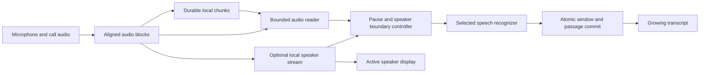

# Semi-live meeting transcription and speaker activity

Implementation and validation status, 17 September 2026. The first working implementation is present in this checkout. This document records the design, completed checks and remaining limits. Private audio, recognition output, provider events and recording-specific reports stay outside the repository.

## Result

New meetings default to **Transcribe while recording**. Text arrives after pauses and, when live labels are enabled, suitable speaker changes. Stop processes the remaining audio and keeps completed passages and corrections. Disabling the option retains transcription after Stop.

**Show live speaker changes** is a separate, optional setting on the New meeting screen. It runs NVIDIA Nemotron 3 Diarization on this PC, shows anonymous active speakers, including simultaneous speakers, and supplies turn boundaries to transcription. Users can name speakers. Call audio and shared microphones use separate speaker streams; identities are never merged across sources.

Orukeet stays local, and so does speaker detection: it needs the downloaded speaker model and no permission. Cloud transcription uses the selected provider and asks for permission to upload during recording. These choices are resolved before recording starts. Changing Settings does not change an active session's provider or key.

## Why transcription previously waited for Stop

Capture already wrote durable five-second audio files, but those files were a storage mechanism. `MeetingService.stop()` started the transcription job, which calculated windows over the complete saved track. There was no recording-time recognition coordinator or live diarization stream. Speaker labels ran over complete saved tracks after Stop.

## Implemented architecture

```mermaid
flowchart LR
    A[Microphone and call audio] --> B[Aligned audio blocks]
    B --> C[Durable local chunks]
    B --> D[Optional local speaker stream]
    C --> E[Bounded audio reader]
    B --> E
    E --> F[Pause and speaker boundary controller]
    D --> F
    D --> G[Active speaker display]
    F --> H[Selected speech recognizer]
    H --> I[Atomic window and passage commit]
    I --> J[Growing transcript]
```

| Area | Implementation |
|---|---|
| Capture | `capture.py` publishes aligned samples to bounded streaming queues and exposes its short unwritten tail. Pause flushes pre-pause audio; Stop while paused discards queued paused input. |
| Boundaries | `segmentation.py` makes causal decisions from available audio and speaker events. Long local dictation shares this controller. |
| Recognition | `live.py` runs outside the batch job queue. Each pass handles at most one window per source, using the shared serialized recognizer or selected cloud adapter. It yields between windows for dictation. |
| Durability | Capture flushes pending audio under its writer lock before a selected range is decoded. Model and network calls run outside that lock. Older ranges are read from intersecting WAV files. |
| Persistence | Schema version 3 adds session options, committed window ranges and speaker turns. One transaction saves passages and advances the contiguous retry cursor. Silence also advances progress. |
| Stable text | Passage IDs include source and owned start sample. Stop and retry do not renumber completed passages. Later batch labels preserve live passage IDs, words and corrections, filling only unambiguous source-labelled passages. |
| Speakers | `streaming.py` runs one worker per source. It pushes saved-time audio into a NeMo-Speech.cpp diarization stream, turns committed frames into speaker starts and ends, and maps them back to saved audio time. |
| Interface | The authenticated `/live` endpoint returns lightweight activity and progress approximately every 300 ms while visible and active. Ordinary detail refreshes remain once per second. Activity updates do not replace the editor. |

Recognition holds one short range at a time; accumulated work is represented by offsets into saved audio. Existing capture queues hold at most about 60 seconds per source, the durable writer tail normally holds less than five seconds, and each speaker queue holds at most 30 seconds. Meetings do not introduce a second full-recording memory buffer.

## Boundary policy

| Signal | Rule |
|---|---|
| Ordinary pause | Wait for 800 ms of low energy and cut inside the quiet interval. |
| Longer phrase | After 12 seconds, accept a 300 ms pause. |
| Speaker change | Consider different, non-overlapping speakers with 400 ms of following audio available. Reject cuts covered by another active speaker. |
| Continuous speech | Limit the owned range to 27 seconds; choose the quietest frame in its final eight seconds when no pause is available. |
| Context | Orukeet uses up to 600 ms of left context and 200 ms of right context. Input stays under 28 seconds. |
| Brief replies | Completed short turns can flush without a six-second minimum. |
| Silence | Advance the saved cursor and skip silent recognition input. |
| Pause and Stop | Flush the available final partial window. Stop waits for recognition and bounded speaker-event draining. |

The energy threshold uses only preceding available frames, up to ten seconds. Acoustic boundaries do not guarantee sentence completion. Adjacent unfinished passages for the same speaker can display as one paragraph while keeping separately editable IDs. Speaker changes, corrections and pause markers can still create display breaks.

Timed subword tokens are grouped into words before assigning ownership or speakers. Word-group midpoints determine the owning window; intentional repeated words are retained. Overlap protects context, but independently decoded hypotheses can disagree at a seam. This is a timing heuristic, not full hypothesis alignment or a guarantee against every missing or repeated word.

Cloud adapters currently return text without word times. They receive disjoint audio ranges without recognition overlap. Passages show approximate timing; mixed or overlapping speakers retain the source label. Continuous speech can still require a forced cut. No word-level timing precision is implied.

## Speaker stream and Pause

Each source pushes mono 16 kHz audio in 100 ms blocks into a NeMo-Speech.cpp diarization stream with 3.04-second chunks and 80 ms of look-ahead. On the 60-second AMI fixture, that geometry ran 8.2 times faster than real time on four threads of a Core i5-13600KF, with the same error rate as labels after Stop. The runtime's 1.04-second default ran only 3.3 times faster, too slow for two tracks next to Orukeet on a laptop. Events update an active set and persist meeting-time turns. Labels are namespaced by source and stream, so a new stream never reuses an old name.

Nemotron 3 Diarization does not revise a frame once the runtime commits it. A causal copy of the runtime's segment postprocessing (onset and offset hysteresis, edge padding, gap filling, minimum duration) turns new frames into starts and ends that are final when reported. The tests compare it with a port of the batch postprocessing on random input.

Each stream also reports a settled position: every start and end before it has been reported. While recording, live transcription cuts a window only before that position, so a passage is attributed after its speaker turns are known. On the AMI fixture, passages arrived a median 4.7 seconds after their speech ended with live speakers on, and 1.7 seconds without. Pause flushes the pending window without waiting. After Stop, transcription waits at most 15 seconds for the speaker stream to drain.

Pause discards captured microphone and call audio, and the speaker stream receives nothing. The model hears the meeting without the paused time, and a piecewise clock maps stream time back to saved audio. Activity is hidden while paused. Dictation comes first here too: while dictation records or decodes, audio waits in a 30-second queue. A stream that falls further behind stops with an error. Recording and pause-based transcription continue, and labels after Stop still work.

Late events do not rewrite committed words or labels. After Stop, optional batch labels fill a live passage only when one speaker covers its time; they do not reconcile anonymous identities or split existing live passages. On the AMI fixture that filled 43% of transcript time after a meeting transcribed live without live speakers, because the other passages contain a speaker change.

## Recovery, editing and retention

Recognition failures preserve audio, completed passages and a durable retry cursor. Retry after Stop continues at the first uncommitted range. A crash marks capture Interrupted; reopening never starts capture or uploads automatically. Explicit retry uses the currently selected provider and applicable upload permission.

Delete and shutdown cancel live work before releasing resources. Committing checks that the meeting and running job still exist, preventing late results from recreating a deleted meeting. Model attempts close on completion and failure. Audio removal is blocked while transcription or speaker processing still needs it. Automatic removal follows successful processing, including a pending automatic batch speaker pass.

Retention is checked at startup, after audio jobs finish and every minute while Ownkey runs. A busy meeting does not prevent other expired recordings from being removed. Deletion rejects late writes from batch transcription and text analysis as well as live processing. New local recognition jobs follow the model directory selected in Settings; existing attempts keep their current model until they finish.

Notes and corrections remain usable during recording. Polling defers full rendering while an input is focused, preserves earlier scroll positions, and follows new text only when already near the bottom. Status distinguishes listening, transcription, catching up, pause, finalization and failure. Recording does not show a misleading completion percentage.

HTTP control actions consume their JSON bodies before connection reuse. This fixes malformed polling requests found during Pause/Resume browser testing. A new token-bearing meeting URL also takes precedence over a stale cookie from an earlier process.

## Long local dictation

Local dictation longer than 15 seconds uses the same bounded controller and word ownership. Short dictation retains a single decode. The caller receives one complete string for the existing rewrite and insertion flow; no multiple clipboard insertions are introduced. Cloud dictation is unchanged.

## Validation

Repository tests use generated PCM, invented text and fake events. They cover pauses, brief replies, limits, sample coverage, whole-word grouping, overlap uncertainty, multiple-pause clocks, paced float32 transport, final-event draining, live passage arrival, stable corrections, retry, deletion during decoding, separate pre-capture consent, cloud windows, retention and HTTP connection reuse.

Private validation used the supplied recording without adding its name, audio, text, screenshots or provider logs to the repository:

- The actual coordinator processed the complete decoded recording in about 3 minutes 32 seconds, using 402 speech windows. The speech source and an equally long synthetic silent second source had exact contiguous sample coverage. No forced cut was required; the longest owned window was 21.8 seconds. This was accelerated saved-audio processing, not a one-hour real-time hardware soak.
- A real-time replay of the AMI fixture as call audio through capture, Orukeet and live speaker labels on this PC produced text before Stop and found three speakers. It attributed 92% of transcript time to the right speaker and left 8% on the Call audio label, mostly short fragments at turn changes. The process used 129% of one CPU core on average with live speakers and 74% without.
- Browser checks with synthetic sources exercised consent and cancellation, text arrival, speaker activity, note focus and persistence while text arrived, live corrections, Pause/Resume, Stop and playback. Expected consent responses were distinguished from unexpected server errors.
- A Windows PyInstaller build succeeded. Its offline smoke test transcribed a private 60-second clip through the new dictation path, unloaded the idle model and reloaded it successfully. Network requests were disabled for that smoke test.

These checks establish pipeline behavior, bounded recognition input and recoverable audio ownership. They do not establish word error rate or true speaker identity. Word counts and recognition disagreement are not substitutes for a manually checked reference.

## Remaining evaluation

Before claiming an accuracy improvement or a latency service level, create a private human-checked reference covering soft speech, noise, music, overlap, proper nouns, negation and sentence continuations. The energy detector can mistake noise for speech or soft speech for silence. Check forced seams against that reference and consider a speech model or richer hypothesis alignment if the results justify it.

An hour-long real-time replay with two speaking hardware sources, deliberate network faults, native window interaction and resource monitoring remains a release-hardening check. Existing gap placement still uses the original capture queue/padding behavior; this change does not establish hardware clock synchronization. Multi-hour speaker streams, reconciling live and batch speaker identities, passage-delta polling and automatic late-event relabelling remain follow-up work.
