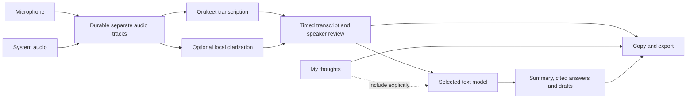

# Ownkey Windows Meetings

Draft feature spec and implementation plan, 16 September 2026. This document
proposes behavior; it does not describe a shipped feature.

Ownkey Meetings records a conversation locally, keeps personal notes separate
from the transcript, and uses the user's chosen text model for summaries,
questions, and follow-up drafts.

## Recommended model decision

Use the existing **Orukeet** integration for transcription. Add a separate,
optional diarization engine for automatic speaker labels. Use a text model for
summaries and drafting. These are three different jobs.

Orukeet is a speech recognizer derived from Parakeet TDT 0.6B v3. Its documented
outputs do not provide speaker diarization. Reusing it is appropriate; adding
pyannote would complement it. [Orukeet model card](https://huggingface.co/oruk/orukeet)

| Recording and expected result | Is a diarization model needed? |
|---|---|
| Transcript and summary without automatic speaker labels | No. |
| Separate microphone and call-audio tracks | No, to label the audio sources. This alone does not identify people. |
| One known person on each isolated track | Not necessarily. The user can assign each track a name. |
| Several remote people mixed into call audio | Yes, for automatic per-person labels. |
| Several people sharing a room microphone | Yes, for automatic per-person labels. |
| Automatically knowing a person's name | Diarization alone is insufficient. Users must confirm names or a separate identification mechanism is needed. |

For the first release, support source labels and manual corrections. Make
automatic speaker separation an optional model download, subject to a Windows
benchmark. Matching the email's multi-person transcript experience requires
this capability; shipping without it is a deliberate reduction in scope.

Evaluate **pyannote Community-1** first. It runs locally after download, supports
CPU execution, and provides an exclusive speaker timeline that can help align
transcript text. Its normal download requires accepting Hugging Face access
conditions and obtaining a token. Those steps must be visible in model setup.
[Community-1 documentation](https://huggingface.co/pyannote/speaker-diarization-community-1)

Keep it out of the base installer until the packaging and performance trial
passes. Its documented stack includes PyTorch, TorchCodec and FFmpeg. Disable
its optional usage metrics explicitly with `PYANNOTE_METRICS_ENABLED=0` in the
Ownkey worker, before library initialization. Do not substitute the hosted
Precision-2 service for the local model.
[pyannote installation and telemetry](https://github.com/pyannote/pyannote-audio)

Also benchmark sherpa-onnx's diarization pipeline because Ownkey already uses
that runtime. It offers separate segmentation and embedding models. This could
reduce packaging overhead, but its pipeline is not equivalent to Community-1;
quality, model licenses and Windows behavior need their own evaluation.
[sherpa-onnx diarization](https://k2-fsa.github.io/sherpa/onnx/speaker-diarization/index.html)

## What the reference establishes

Reviewed all four pages of the supplied `Email.PDF`, including its promotional
images. This PDF contains one hero image and three feature illustrations; the
earlier outline's reference to two hero variants is not present in this file.

| Evidence in the PDF | Ownkey interpretation |
|---|---|
| Page 2: My thoughts, Transcript and Summary tabs | Three separate records within one meeting. |
| Pages 1 and 3: transcript text assigned to named speakers | Editable speaker assignments; the identification method is unspecified. |
| Page 2: short summary, reading-time label, search and copy icons | Skimmable summary and straightforward copy/search controls. |
| Page 2: question about launch blockers and a contextual answer | Ask questions about a meeting, with transcript references added by Ownkey. |
| Page 2: follow-up email draft | Generate a draft for review and copying. Automatic sending is not demonstrated. |
| Page 3: notes/transcript illustrated alongside AI-tool logos | Explicit export first; deeper integrations later. The connection protocol is unspecified. |
| Page 2: dictionary, calendar and meeting context | Optional vocabulary and metadata support, after engine capability is validated. |
| Page 3: automatic detection, calendar connection and reminders | Later opt-in start suggestions and calendar association. |
| Page 3: Granola and Otter imports | Later import adapters based on actual export samples. |
| Page 4: inform participants before recording | A start-time reminder and explicit start action. |

The PDF does not establish Wispr's capture implementation, model choices,
storage format, encryption, synchronization protocol or recovery behavior. Its
hardware recommendation is not an Ownkey requirement.

## Repository baseline

Inspection covered the meeting worktree at `0a1ff3a` on
`t3code/add-meeting-notetaker` and the other local checkout at
`E:/Development/ownkey-windows`, on `feature/orukeet-local-transcription-plan`.
That checkout has uncommitted local-model implementation files. A merge of its
current committed branch alone would not bring over the full implementation.
This specification does not copy or change that work.

| Existing code or evidence | Consequence for meetings |
|---|---|
| `ownkey.py`: microphone-only `sounddevice.InputStream`, frames accumulated in memory | Add durable dual-source capture; do not extend the dictation frame list to hour-long sessions. |
| `providers.py`: transcription returns a string | Introduce structured meeting results while preserving the dictation API. |
| Other checkout's `local_transcription.py`: Orukeet INT8, sherpa-onnx 1.13.8, four CPU threads, serialized decoding, model leases and idle unloading | Reuse the model installation and lifecycle work. Add timing output and a meeting job interface. |
| Its `_decode()` returns only `stream.result.text.strip()` | Existing Ownkey output has no usable speaker or timing records. |
| Its `docs/ORUKEET_VALIDATION.md`: short synthetic English/Dutch clips; longest about 41 seconds, with words lost in the longer Dutch clip | This is runtime evidence, not evidence of meeting-length accuracy or reliability. |
| Its `local_rewrite.py` and validation: experimental Qwen3 1.7B, 8,192-token runtime context | Reuse local text inference infrastructure, but evaluate meeting tasks separately and handle context limits. |
| Tauri frontend: small, non-focusable status overlay, UDP state updates | Add a proper resizable meeting window and reliable request/response transport. |
| Current config persistence writes API keys into JSON | Encrypted credentials are a requirement from the supplied trust contract, not an implemented property of either inspected checkout. |

The existing provider adapters and local-model managers are useful foundations.
Neither meeting capture nor complete meeting analysis is already implemented.

## First useful release

### Start and capture

1. Open **Meetings** from the tray and select **New meeting**.
2. Enter an optional title. Choose **Microphone + system audio**, **Microphone**,
   or **System audio** and select the relevant devices.
3. Show input meters, the capture scope, available storage and model readiness.
   Explain that system audio includes other sounds played through the selected
   output device. No audio is persisted before Start.
4. Show **Let everyone know you are recording** beside the Start action. Ownkey
   does not imply that it notified remote participants.
5. Start immediately once capture is ready. A missing model may defer
   transcription; it must not trigger an automatic download or cloud fallback.
6. Keep a visible recording indicator, elapsed time, source meters, **Pause**
   and **Stop** available while the meeting window is minimized.

Pause stops persisting and processing new audio from every selected source.
Resume is explicit. Store pause intervals so transcript times and later playback
stay aligned. Stop closes capture before transcription or analysis continues.

Closing the meeting window minimizes it while capture continues. Quitting the
app during capture offers **Stop and save** or **Keep recording**. Sleep, a
required device disappearing or an unrecoverable write failure ends active
capture safely and marks the meeting interrupted. Never resume recording on
restart without a user action.

During active meeting capture, the meeting owns its audio devices. In the first
release, dictation/rewrite hotkeys show the meeting status instead of starting
another recording. They work normally after Stop. Typed notes remain available
throughout. Concurrent voice dictation into notes is later scope.

### Review one meeting

The meeting window has a library on the left and three tabs for the selected
meeting. Use Ownkey's existing visual language, with readable document text.

| Tab | Behavior |
|---|---|
| **My thoughts** | Editable, autosaved personal notes. AI never overwrites this record. Notes can optionally carry a meeting timestamp. |
| **Transcript** | Searchable timed passages, source/speaker labels, text corrections, speaker rename and passage reassignment. A timestamp opens playback when audio is retained. |
| **Summary** | Overview, decisions, action items and unresolved questions. Each factual item links to supporting transcript passages. Missing owners or dates stay unassigned. |

Keep the original recognition output and user corrections as separate revisions.
Default labels are **Microphone** and **Call audio**. Offer **You** only after
the user confirms that the microphone represents them. When diarization is
enabled, use **Speaker 1**, **Speaker 2**, etc., until the user confirms names.
Support assigning a label to one passage or renaming that speaker throughout
the meeting. Do not infer identities from calendar attendees alone.

Show transcription progress after Stop. Live transcription is not a first-release
promise. Notes and completed transcript passages remain usable if a later stage
fails. Mark a summary as outdated after relevant transcript or speaker edits.

### Summarize, ask and draft

Provide a meeting-specific text-model setting, initially suggested from the
existing rewrite provider. The user chooses a local model or a direct provider
connection. Local audio transcription does not imply that cloud text analysis
is local.

Before the first remote analysis, show the provider and the content that will
be sent. Remember the user's chosen policy. Audio stays on-device for this
Orukeet-based flow. Personal notes are excluded from AI context by default;
including them is a visible option, and answers distinguish notes from speech.

**Generate summary**, **Ask this meeting** and **Draft follow-up** are explicit
actions. A configured auto-summary option may run after transcription completes.
Without a text model, recording, notes, transcript review and export still work.

Answers reference stable transcript passage IDs and timestamps. Validate that
references exist and belong to the selected meeting revision. A citation alone
does not prove support: evaluate whether the cited passage supports the claim.
When the record cannot answer a question, say so. Distinguish suggestions from
recorded decisions. Treat instructions inside meeting content as source text,
not commands to the application.

For long meetings, extract evidence from bounded transcript sections, retain
passage references through synthesis, and retrieve original passages for
questions. Reserve room for both prompt and output within the actual model's
context limit. Never silently truncate the end of a meeting.

Follow-ups remain editable drafts with Copy and Export. The first release has
no send action or tool execution. Use Markdown/text for exports, with separate
sections for notes, transcript and summary. A JSON export preserves IDs,
timestamps, revisions and speaker mappings for later import.

## Capture and transcription design

Use WASAPI loopback for system audio alongside microphone capture. Windows
supports capturing a rendering endpoint's output, including audio from multiple
apps. This must be described accurately in the source picker.
[Microsoft loopback documentation](https://learn.microsoft.com/en-us/windows/win32/coreaudio/loopback-recording)

App-specific capture is a later improvement. Microsoft's process-loopback
sample requires build 20348 or later and captures a process tree; that is not
equivalent to selecting one browser meeting tab. Detect support at runtime and
retain endpoint capture for older supported Windows versions.
[Microsoft process-loopback sample](https://learn.microsoft.com/en-us/samples/microsoft/windows-classic-samples/applicationloopbackaudio-sample/)

Persist the two sources independently. Record device timestamps, sample counts
and a common monotonic timeline; account for different sample rates and clock
drift before combining transcript turns. Resample decoding input to Orukeet's
required mono 16 kHz format. Headphones reduce remote-audio bleed into the
microphone; echo, overlapping speech and Bluetooth routing need real tests.
Do not remove text merely because it resembles another track's words.

Capture callbacks only enqueue audio into a bounded buffer. A writer stores
short recoverable chunks and commits their metadata. Initial engineering
targets are five-second durable chunks and at most five seconds lost on process
failure. These are proposed acceptance targets, not measured guarantees.
An overrun creates a visible gap/error; it cannot become silent data loss.

Decode bounded speech windows with silence-aware boundaries and tested overlap.
Start trials around 10-30 seconds, flush the final partial window, and measure
Dutch and English boundary errors. Preserve offsets when skipping silence.
Resolve duplicate words in overlapping windows using timing and context;
never deduplicate intentional repetitions by text alone.

Extend local transcription with a separate structured result containing text,
tokens and available times. sherpa-onnx 1.13.8 exposes timing and duration fields,
but their availability and accuracy must be checked with the pinned Orukeet
export. Token times are not automatically word boundaries. Keep the existing
string-returning dictation method as a compatibility wrapper.
[Pinned sherpa-onnx result bindings](https://raw.githubusercontent.com/k2-fsa/sherpa-onnx/v1.13.8/sherpa-onnx/python/csrc/offline-stream.cc)

Run diarization over a meeting track or use a method that retains speaker
identity across processing windows. Independent chunk-local labels cannot be
concatenated as if Speaker 1 always means the same person. Align speaker turns
with timed words, splitting passages at speaker changes. Preserve uncertainty
and overlap; speaker separation does not recover words that ASR missed when
two people spoke simultaneously.

Keep inference outside capture callbacks. Schedule bounded jobs so background
meeting processing yields to dictation after recording ends. Model leases must
cover active inference and prevent removal/unloading while in use. A separate
optional diarization worker keeps its dependencies and failures isolated from
the tray process. Benchmark aggregate memory before loading ASR, diarization
and a text model together.

## Storage, trust and recovery

Use `%LOCALAPPDATA%\Ownkey\meetings` for the default library. Store metadata,
transcript revisions, notes and job state in SQLite; store audio in per-meeting
directories. Audio chunks become durable before their manifest records commit.
Startup reconciliation handles orphaned chunks and unfinished jobs.

| Record | Minimum information |
|---|---|
| Meeting | ID, title, creation time, capture state, elapsed timeline, sources, model revisions, retention choice |
| Audio chunk | Meeting/source ID, sequence, offset, sample rate/count, file reference, checksum, durability state |
| Passage | Stable ID, source, start/end, original text, corrected text, speaker assignment, timing quality, revision |
| Speaker | Meeting-local ID, display name, user-confirmed status |
| Notes | Meeting ID, content and edit revision |
| Analysis | Kind, text/model/provider, input revisions, included-note flag, passage references, completion state |
| Job | Stage, input revision, progress, attempts, error and cancellation state |

Proposed retention default: retain audio locally for seven days after successful
transcription, and retain notes/transcripts until deletion. Interrupted or failed
jobs keep recovery audio until completion or explicit deletion. Before Start,
show this policy and offer keep-until-deleted or remove-after-transcription.
Deletion of audio disables playback and reprocessing; text citations still work.
All of these defaults are product proposals, not requirements derived from Wispr.

Delete meeting cancels active jobs and removes audio, text, generated outputs,
search entries and temporary data. It must prevent a completing worker from
recreating the meeting. Explain that independently exported copies remain.
Deletion does not claim forensic erasure from disk or user-managed backups.

Retain Ownkey's no-account, no-telemetry and direct-provider behavior. Model
downloads are explicit, pinned and verified. Failure never switches a local
meeting to a cloud model. Before enabling remote meeting analysis, migrate API
credentials to Windows-protected storage and remove plaintext copies from active
config; failed migration must preserve access to the original settings.
Credential protection does not encrypt the meeting library. The initial library
relies on the user's Windows account and filesystem protection; do not describe
it as application-encrypted. Library encryption is a separate product decision.

| Failure | Required user-visible result |
|---|---|
| App/process crash | Recover durable audio and autosaved notes; mark Interrupted; offer processing or explicit resume. |
| Device loss or sleep | Stop active capture safely and show the affected source/time. No silent switch. |
| Disk full or write error | Stop persisting capture, preserve completed chunks, show an error. |
| Model missing or inference failure | Keep the meeting and offer model setup/retry. |
| Diarization failure | Keep the transcript with source labels; retry speaker labeling separately. |
| Text provider outage, expired key or context error | Keep transcript and notes; retry analysis independently. |
| Cancellation or restart during processing | Resume from committed jobs without duplicate passages or overwritten corrections. |

## Delivery sequence

| Stage | Work | Exit evidence |
|---|---|---|
| 0. Integrate the local foundation | Bring the reviewed Orukeet implementation into the meeting branch once its complete work is available as commits. Preserve current cloud and Linux behavior. | Existing local/cloud provider and lifecycle checks pass on the integrated source. |
| 1. Prove capture and timing | Build an isolated Windows capture probe, durable chunk writer, Orukeet timing probe and alignment experiment. No microphone capture starts without the user's action. | Real dual-track recordings, drift/recovery measurements, accurate time mapping and bounded memory. |
| 2. Ship the recording library | Add meeting state/store, source selection, meeting window, typed notes, pause/stop/recovery, transcript review, source labels and export. | Complete start-to-export flow survives interruption without losing committed data. |
| 3. Add meeting analysis | Dedicated prompts, context budgeting, cited summaries/questions, editable drafts, local/remote disclosure, protected credentials. | Dutch/English meeting fixtures retain decisions, negations, owners and evidence through long-context processing. |
| 4. Add optional automatic speakers | Compare Community-1 and sherpa diarization, package the selected worker/models, align turns, expose corrections and retry. | Speaker accuracy, runtime, memory, offline behavior and packaged Windows setup meet the chosen release targets. |
| 5. Extend the workflow | Calendar, detection suggestions, history imports, cross-meeting questions and external integrations. | Each feature has explicit scope, provenance and user-controlled data sharing. |

Suggested boundaries are `meetings/capture_windows`, `meetings/store`,
`meetings/transcription`, `meetings/diarization` and `meetings/analysis`, with a
new meeting view in `overlay-ui`. Reuse the local model manager rather than
creating another downloader. Use authenticated local request/response IPC
with request IDs and acknowledgments for meeting commands. Keep UDP limited to
disposable visual updates. The backend owns meeting state and capture lifetime.

## Validation before release

The following are planned checks. None were executed by writing this spec.

- Record a 60-minute meeting with two audio sources, then a 120-minute soak on
  the intended baseline Windows machine. Verify bounded buffers, memory,
  storage use and alignment at the start, middle and end. An initial target is
  under 250 ms source drift across an hour; measure ASR timing error separately.
- Test a headset call, speakers with echo, Bluetooth routing, multiple remote
  participants, a shared room microphone, simultaneous speech and silence.
  Include natural Dutch, English, names and code-switching.
- Kill the process at chunk-write and database-commit boundaries. Check the
  five-second recovery target, retained notes, final partial audio, retry
  idempotence and deletion while a worker completes.
- Exercise Pause, rapid Stop, sleep, device unplug, disk exhaustion, corrupt
  chunks, unavailable models and provider failure. Show every recording gap.
- Check actual Orukeet token timing against annotated audio. Confirm chunk
  boundary words are neither lost nor repeated and speaker IDs remain stable
  across a long meeting.
- Evaluate diarization on annotated meetings using speaker confusion, missed
  speech, false speech and overlap, alongside human correction effort. Record
  CPU time, peak RAM, download/install size and time after Stop. Choose numeric
  release thresholds from this trial before promising automatic speaker labels.
- Evaluate summaries and answers on supported and unanswerable questions,
  conflicting notes, corrections, uncertain owners, dates, negations and
  malicious instructions spoken in the meeting. Verify citation support.
- Run installed local transcription, diarization and local analysis with
  outbound traffic blocked after model setup. Observe attempted connections;
  merely mocking Requests does not establish absence of network access.
- Test an ordinary CPU-only Windows installation without developer runtimes,
  plus the supported Windows 10 endpoint-capture path. Verify installer signing,
  optional dependencies and the existing dictation/overlay lifecycle checks.

## Later features and unresolved choices

Automatic meeting detection suggests starting capture; it never starts it.
Calendar access is optional and supplies titles/attendee candidates, not proof
of speaker identity. Scope browser capture honestly if other tabs share the
same process. Vocabulary hints need a separate Orukeet decoder experiment;
the current greedy decoder must not be advertised as dictionary-aware.

Cross-meeting questions should retrieve original passages with meeting titles,
dates and stable citations. Start with local text search; embeddings are a
separate measured choice. Competitor imports preserve original source metadata
and flag missing timing or speaker information. Explicit Markdown/JSON export
covers the first external AI workflow; later connectors require their own
destination and sharing controls.

The next implementation decisions are the minimum Windows hardware target,
whether automatic speaker labels are required at first public release, the
retention default, the selected diarization package, and whether the meeting
library needs application-level encryption. The recommendation above allows
capture and transcription work to proceed while these choices are evaluated.
